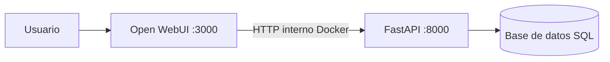

# CAPS-Link · Plataforma 

CAPS-Link es una solución dividida en dos componentes:

- **`caps-link/`**: interfaz conversacional (Open WebUI) y orquestación Docker.
- **`tools_sql/`**: API clínica en FastAPI con acceso a base SQL (pacientes, profesionales, consultas).

El objetivo es que el usuario interactúe en lenguaje natural desde WebUI, y que esas acciones se traduzcan en operaciones reales contra la API clínica.

---

## 📦 Estructura general

```text
hackaton_gemma4/
├── caps-link/      # WebUI + compose + modelfiles + backup/restore UI
└── tools_sql/      # FastAPI + lógica clínica + persistencia SQL
```

---

## 🧠 Arquitectura 



### Flujo típico
1. Usuario escribe en WebUI (ej: “Juan Pérez vino por dolor abdominal”).
2. WebUI ejecuta una Tool / función Python.
3. La Tool llama a FastAPI (`/api/pacientes`, `/api/consultas`, etc.).
4. FastAPI valida (Pydantic), aplica lógica y persiste en SQL.
5. WebUI responde al usuario con resultado legible.

---

## ✅ Requisitos

- Docker + Docker Compose v2
-  Ollama - gemma4
- Puertos disponibles:
  - `3000` (WebUI)
  - `8000` (FastAPI)

Verificación:
```bash
docker --version
docker compose version
```

---

## 🚀 Puesta en marcha

> Ejecutar comandos desde `caps-link/`, que contiene los compose.

### 1) Levantar stack con WebUI + FastAPI
```bash
docker compose -f docker-compose-fastapi.yml up -d --build
```

### 2) Verificar servicios
```bash
docker ps
```

Esperado:
- `caps-link-webui` en `0.0.0.0:3000->8080/tcp`
- `caps-link-fastapi` en `0.0.0.0:8000->8000/tcp`

### 3) Probar accesos
- WebUI: http://localhost:3000
- FastAPI docs: http://localhost:8000/docs
- Health: http://localhost:8000/health

---

## 🔗 Integración entre servicios (clave)

Dentro de Docker, WebUI debe llamar FastAPI con hostname de servicio:

- ✅ `http://fastapi:8000`
- ❌ `http://localhost:8000` (desde el contenedor webui no correspond, pero funciona si la pc hace de host)

Ejemplo:
- `GET http://fastapi:8000/api/profesionales`

---

## 💾 Persistencia y backups

Los datos de WebUI viven en un volumen Docker (por ejemplo `caps-link_open_webui_data`).

### Backup
```bash
docker run --rm \
  -v caps-link_open_webui_data:/volume \
  -v ${PWD}:/backup \
  alpine sh -c "cd /volume && tar czf /backup/open_webui_data_backup.tar.gz ."
```

### Restore
```bash
docker run --rm \
  -v caps-link_open_webui_data:/volume \
  -v ${PWD}:/backup \
  alpine sh -c "cd /volume && tar xzf /backup/open_webui_data_backup.tar.gz"
```

> Importante: evitar `docker compose down -v` si no querés borrar datos persistidos.

---

## 📚 READMEs por componente

- [`caps-link/README.md`](./caps-link/README.md)  
  Guía de WebUI, compose y backup de interfaz.
- [`tools_sql/README.md`](./tools_sql/README.md)  
  API FastAPI, endpoints, `.env`, persistencia y desarrollo backend.

---

## 🛠️ Troubleshooting rápido

### `no configuration file provided: not found`
Estás fuera de la carpeta con compose.  
Entrar a `caps-link/` o usar `-f` con ruta completa.

### `env file ... not found`
Falta `.env` del backend en la ruta esperada por `docker-compose-fastapi.yml`.

### WebUI no conecta con FastAPI
- Verificar que ambos contenedores estén arriba.
- Confirmar URL interna `http://fastapi:8000`.
- Test:
  ```bash
  docker exec -it caps-link-webui sh
  wget -qO- http://fastapi:8000/health
  ```

---

## 🗺️ Roadmap sugerido

- [x] WebUI containerizado
- [x] FastAPI containerizado
- [x] Comunicación interna por red Docker
- [x] Persistencia y backup de WebUI

---

## 👤 Autoría

Proyecto CAPS-Link desarrollado por el equipo del hackatón.
Venialgo Andres
Grigolatto Juan 
Kruk Oriana 
Rey Natalia